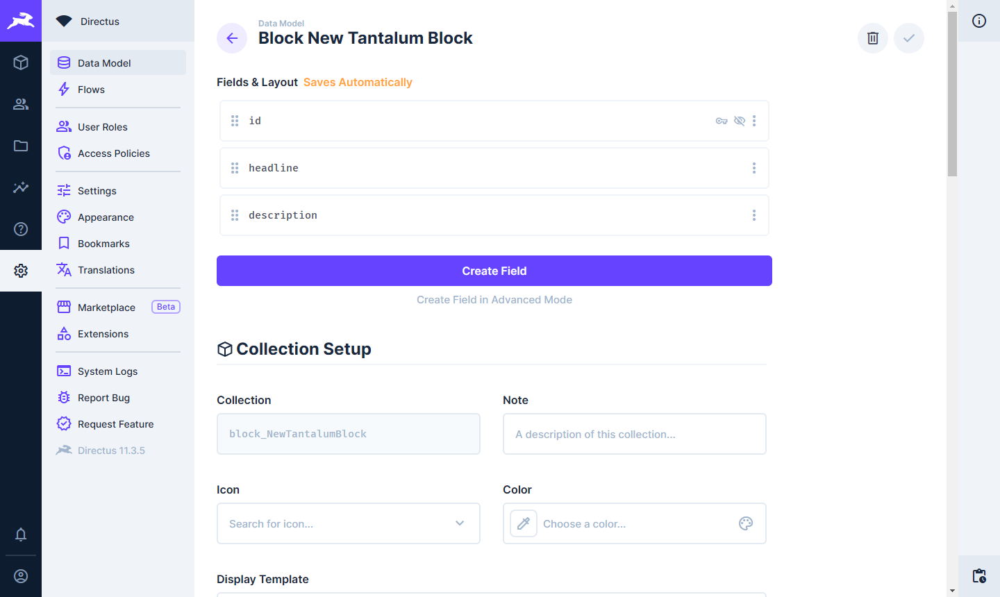
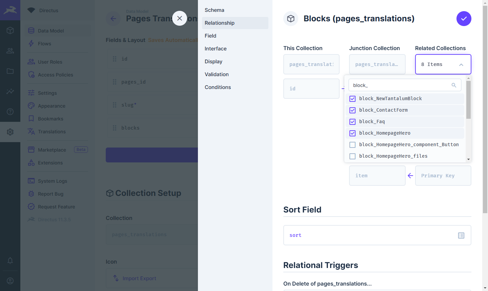
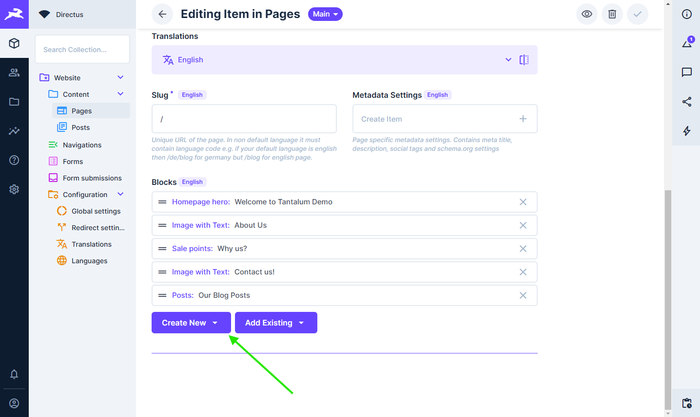
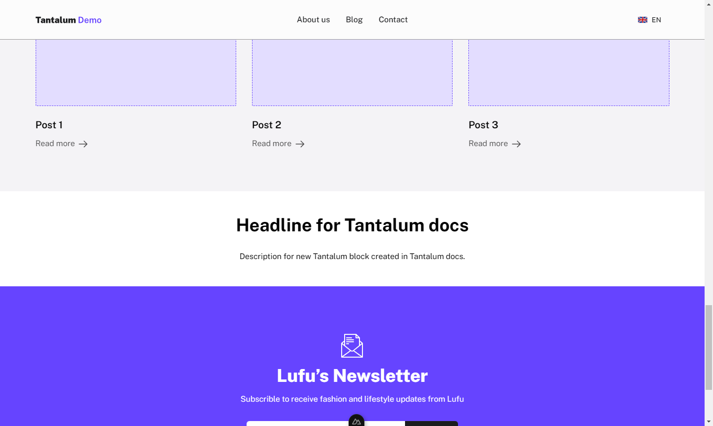

# Blocks

Are main building part of pages they are sections of your page that have their own styling and are indenpended on each other. They are ment to be used by end user to adjust pages to their needs.

## Adding new Blocks

Before using block in FE code it must be defined in Directus.

### Define block in Directus

1. Create collection named `block_NewTantalumBlock` with `id` being `UUID`.
   ::: danger
   Follow naming scheme of `block_<name-of-block-in-upper-cammel-case>` eg. `block_NewTantalumBlock` this way we can differentiate data model types as well as get name of Vue component in Frontend. If you do not follow this convention new block will not load and Vue will throw errors. Same goes for UUID. This is very important as you cannot change it later.
   :::
2. In collection add following fields:

   ```
   block_NewTantalumBlock

   - headline (Type: String, Interface: Input)
   - description (Type: Text, Interface: Textarea)
   ```

   

3. (Optional) You can add custom name for your block. By default it will be changed to: `Block New Tantalum Block`. If you wish to change it scroll to **Collection Naming Translations** and click **Create new** in fill all required fields in form. I will skip this part.
4. For organization move created collection to `blocks` folder. This way we can also easly hide it.

---

#### Allow for selection in content type

1. Navigate to settings of `pages_translations` collection.
2. Click `blocks` input so that you can see it's settings.
3. Go to **Relationship** tab.
4. Click **Related Collections** and search for newly created block (`block_NewTantalumBlock`), add it to allowed blocks by checking checking checkbox.
5. Save input settings. 
6. (Optional) You can do the same to `posts_translations` if you have it.

---

#### Adjust security policy

1. In settings go to **Access Policies**.
2. Click on **Public**.
3. Scroll to bottom and click on **Add Collection** at the bottom of the Permissions list. 
4. Search for newly created block (`block_NewTantalumBlock`) and add it to the list.
5. Allow **All access** to **Read** action.

---

#### Add block to page

1. In directus open page that you would like to add your block too. I will use homepage.
2. Scroll to block settings and click **Create New** 
3. From list select your block.
4. Fill your content.
5. Save block.
6. Save page settings (Ctrl + S).

### Adding block in Nuxt

After defining block in Directus it is time to add it to our FE code.

::: warning
Before we continue restart your Nuxt enviroment as this will generate Directus types needed for Vue. That way we can get type support.
:::

#### Create Vue component

1. Create Vue component named `NewTantalumBlock.vue` in your FE code under **app > components > blocks**
2. Add script setup snippet into component

```vue
<script setup lang="ts">
import type { BlockNewTantalumBlock } from '#build/directus-types';

defineProps<BlockNewTantalumBlock>();
</script>
```

3. Add your template tag. Here is example one

```vue
<template>
  <section class="w-full flex justify-center py-12">
    <div class="container w-full max-w-screen-xl">
      <h2 class="text-4xl font-bold text-center mb-8">{{ headline }}</h2>

      <p class="text-center">{{ description }}</p>
    </div>
  </section>
</template>
```

Because of [Directus SDK](https://directus.io/docs/guides/connect/sdk) we are automatically getting all types for that block. This together with Typescript support in Vue allows us for easy block definition.

::: warning
For now you wont see anything on your page check next section to see block on page.
:::
4. Because of multilangual setup and improved type support we have to modify Vue component to tell directus witch fields to get. Modify your Vue component script tags like below.
  ```vue
  <script lang="ts">
    import type { Schema, BlockNewTantalumBlock } from '#build/directus-types';
    import type { QueryFields } from '@directus/sdk';

    export const block_NewTantalumBlock: QueryFields<
      Schema,
      BlockNewTantalumBlock
    > = ['id', 'headline', 'description'];
  </script>

  <script setup lang="ts">
    import type { BlockNewTantalumBlock } from '#build/directus-types'; // [!code --]

    defineProps<BlockNewTantalumBlock>();
  </script>
  ```

#### Add new block to retrieve

1. Navigate to **app > > shared > availableBlocks.ts**
2. Import exported `block_NewTantalumBlock` from your Vue component. Then add it to `availableBlocks`
```ts
  // ..
  import { block_NewTantalumBlock } from "~/components/Blocks/NewTantalumBlock.vue"; // [!code ++]

  export const availableBlocks = {
    // ..
    block_NewTantalumBlock // [!code ++]
  };

  // ..
```
3. That's it :tada:. Now opening your homepage should display your new block. If you've not changed order of blocks it should be on the bottom, right above newsletter. 

## Editing existing blocks

1. Open your block collection data model in directus, add/remove fields.
2. Restart Nuxt enviroment.
3. Open Vue component responsible for that block and delete/add fields that you changed.
5. That's it :tada:.

:::danger
  Deleting field will cause all data for that field to be deleted. This cannot be undone.
:::

## Removing blocks

1. Open your block collection data model and delete it using trash icon in top left corner.
2. Restart Nuxt enviroment.
3. Remove Vue component.
4. Remove block import from **[[page_name.vue]]**.
5. Remove block from `availableBlocks`.
6. Go to pages where you've used that block and remove it. It will be called "Invalid Item".
6. That's it :tada:.

:::danger
  Deleting block will remove all blocks from your pages. This cannot be undone. If block was not deleted from content type item it will show as Invalid.
:::

## Using blocks without CMS
