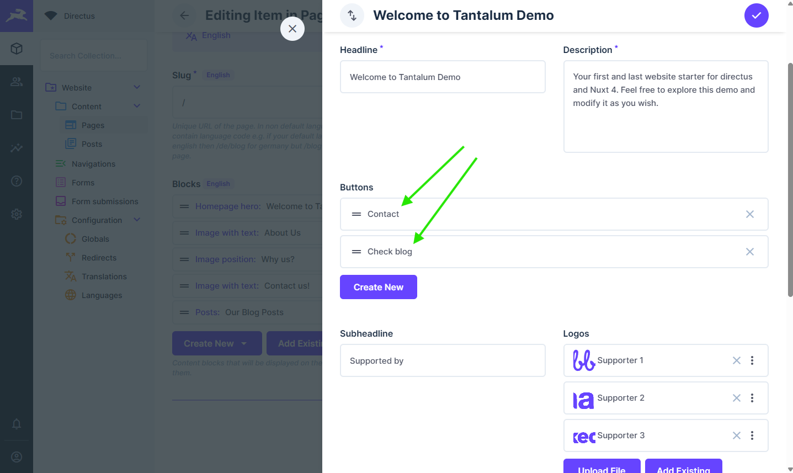

# Components

Are pieces of reusable structure that contains more than one field and can be added by end user. They are ment to be used inside blocks with **Create** button being enabled.

## Adding new Components

### Define component in Directus

1. Create collection named `component_[your_component_name]` with `id` being `UUID`.  Let's extend our block created in [managing blocks section](/content-management/blocks.html#create-vue-component) by adding option to add multiple cards that contain headline and description.
    ```
    component_NewTantalumBlockCard

    - headline: (Type: String, Interface: Input)
    - description: (Type: Text, Interface: Textarea)
    ```
    
    :::info
      While naming is optional I would highly advise to use it so that it is consistent and easy to read.
    :::
2. For organization move created collection to `components` folder. This way we can also easly hide it.

### Add Component to block

1. Open block that you would like to add your component to.
2. Create new field as interface select `Many to Many` as collection select your component. You can use whatever key makes sense. For our example I will use `cards`.
    :::info
      I advise to unselect `Enable Select Button` as it can cause confusion to end user because selecting component will cause all updates to be visible in every place where this component is used. This step is completely **Optional**.
    :::
3. After creating field click on it and setup **display template** use most reasonable field for it, I will use `headline`. Display template is visible when editing block, see image below.

4. Go back to **Data model settings** and open newly created collection (most likely on the bottom of data-models)
5. Add new field named `sort` (Type: Integer, Interface: Input) and make it hidden. This will allow us to add sorting in place where we've used this component.
6. Move newly created collection under block where you've added this component to.
7. Once again open block where you've added your component and click on that field. Go to **Relationship** tab and set sort field as `sort`.
7. Add/Edit block where you've added your components.


### Adjust security policy

1. In settings go to **Access Policies**.
2. Click on **Public**.
3. Scroll to bottom and click on **Add Collection** at the bottom of the Permissions list. 
4. Search and add `component_[your_component_name]`, `block_[block_name]_component_[component_name]` to the list.
6. Allow **All access** to **Read** action.

### Defining component in Nuxt

After defining component in Directus it is time to add it to our FE code.

::: warning
Before we continue restart your Nuxt enviroment as this will generate Directus types needed for Vue. That way we can get type support.
:::

#### Create Vue component

1. Create Vue component named `Base[YourComponentName].vue` in your FE code under **app > components > base**. Naming in this case is optional. I will create `BaseNewTantalumBlockCard.vue`.
2. Add script and script setup snippet into component

```vue
  <script lang="ts">
    import type { Schema, ComponentNewTantalumBlockCard } from '#build/directus-types';
    import type { QueryFields } from '@directus/sdk';

    export const component_NewTantalumBlockCard: QueryFields<
      Schema,
      ComponentNewTantalumBlockCard
    > = ['id', 'headline', 'description'];
  </script>

  <script setup lang="ts">
    defineProps<ComponentNewTantalumBlockCard>();
  </script>
```

3. Add your template tag. Here is example one

```vue
<template>
  <div class="flex border border-1 rounded-md border-primary p-6">
    <div class="container w-full max-w-screen-xl items-center flex flex-col">
      <span class="text-2xl font-bold text-center mb-2">{{ headline }}</span>

      <p class="text-center">{{ description }}</p>
    </div>
  </div>
</template>
```

4. Modify block to retrieve new component
  ```vue
    <script lang="ts">
      import type { Schema, BlockNewTantalumBlock } from "#build/directus-types";
      import type { QueryFields } from "@directus/sdk";
      import { component_NewTantalumBlockCard } from "../Base/BaseNewTantalumBlockCard.vue"; // [!code ++]

      export const block_NewTantalumBlock: QueryFields<
        Schema,
        BlockNewTantalumBlock
      > = [
        "id", 
        "headline",
        "description",
        { // [!code ++]
          cards: [{ component_NewTantalumBlockCard_id: component_NewTantalumBlockCard }], // [!code ++]
        }, // [!code ++]
      ];
    </script>

    <script setup lang="ts">
      defineProps<BlockNewTantalumBlock>();
    </script>

    <template>
      <section class="w-full flex justify-center py-12">
        <div class="container w-full max-w-screen-xl">
          <h2 class="text-4xl font-bold text-center mb-8">{{ headline }}</h2>

          <p class="text-center">{{ description }}</p>

          <div class="grid grid-cols-3 mt-8 gap-x-4">  <!-- [!code ++] -->
            <BaseNewTantalumBlockCard 
              v-for="card in cards"
              :key="card.component_NewTantalumBlockCard_id.id"
              v-bind="card.component_NewTantalumBlockCard_id"
            /> <!-- [!code ++] -->
          </div> <!-- [!code ++] -->
        </div>
      </section>
    </template>
  ```
5. Your block should now look like that.

6. That's it :tada:.

## Editing components

Editing components is very straightforward as you only have to modify them in Directus component collection and in one place on FE.

1. Navigate to component that you would like to edit.
2. Make your changes and save them.
3. Go to Nuxt component and change fields that you are retrieving.
4. That's it :tada:.

## Removing components

1. Go to block definition where you've used your component and remove component related fields.
2. Go back to datamodels and remove component related collection naming should be `block_[block_name]_component_[component_name]`.
3. Remove component collection
4. Restart your nuxt env.
5. In Nuxt open your component and then in your IDE search for `component_[component_name]` this will search for all blocks where you've used your component.
6. Remove code related to component it is retrieving, showing.
7. Remove component vue file.
8. That's it :tada:.