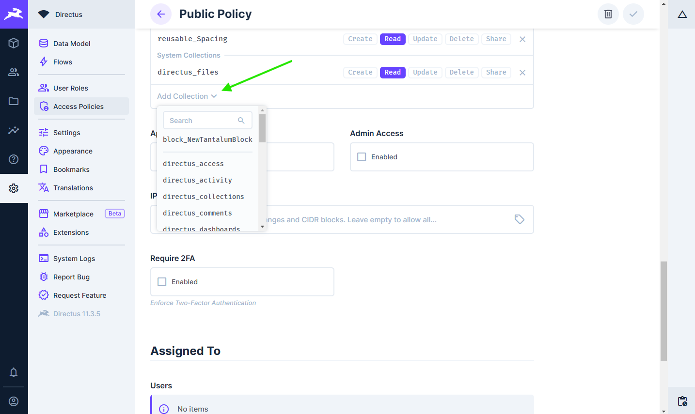

# Reusables

Reusables are elements that have fixed structure and can be selected from dropdown. E.g. usage: spacings that are shared between blocks, using this technique you can easly add/edit spacings in every block.

## Adding reusables

### Define reusable in Directus

:::info
End users should not be able to add anything there therefore this collection should be hidden and used only as dropdown without create button.
:::

1. Create collection with following structure:
    ```
    reusable_[your_reusable_name] (Namig is optional I wanted to keep things organised)

    - id (Type: Manually entered string) - Value that you will retrieve in code
    - displayValue: (Type: String, Interface: Input) - This will be visible in Directus so should be user friendly.
    ```
2. Navigate to **Content**
3. Right click on the list click `Show Hidden Collections`
4. Select your reusable
5. Add new items
6. That's it :tada:.

### Adjust security policy

1. In settings go to **Access Policies**.
2. Click on **Public**.
3. Scroll to bottom and click on **Add Collection** at the bottom of the Permissions list. 
4. Search for newly created reusable (`reusable_[your_reusable_name]`) and add it to the list.
5. Allow **All access** to **Read** action.

## Editing reusables

1. Open reusable that you would like to edit
2. Make adjustements.
3. Save your changes.
4. That's it :tada:.

:::info
If you've made changes to values remember to also change code.
:::

## Removing reusables

1. Find all fields where your reusable is used and remove them.
2. Delete your reusable collection.
3. Remove code support (If applicable)
4. That's it :tada:.

:::warning
If you don't delete field, it will show that you don't have access to it. So it is not gamebreaking bug.
:::

## Using reusables in Directus

1. Open collection where you would like to use reusable
2. Create new field in desired collection as interface select `Collection Item Dropdown` as collection select your reusable. Setup **display template** to use `Display value` field of your reusable.
3. That's it :tada:.

## Using reusables in Nuxt

Because reusable is just another field all you have to do is retrieve it the same way as it is described in [Managing blocks](/content-management/blocks.html#create-vue-component) and then use it.