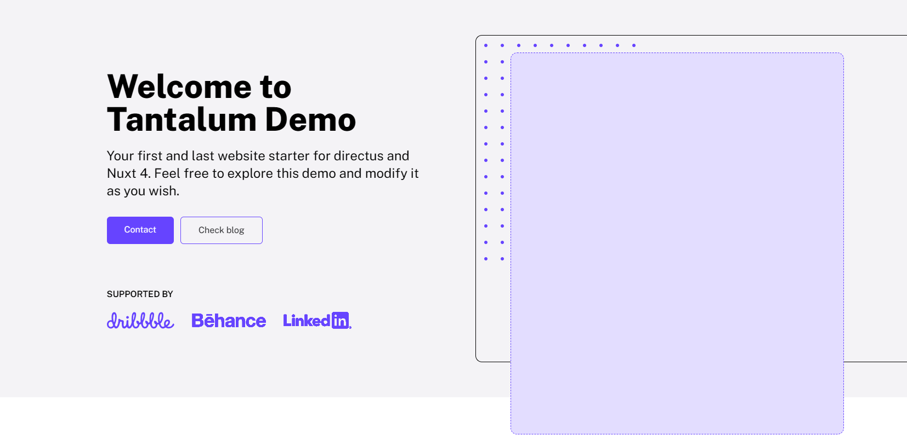

# Demo

Using CLI will setupup demo for you to use. You can modify it or use as it is and just fill content.

## What is included in demo?

Demo inludes several blocks. They are responsive and production ready. If you don't want to spend too much time on designs you can just use them.

### Homepage hero

### Image with Text

### Sale points

### Blog posts display

### FAQ

### Subpage hero

### Contact with contact form

---

Beside blocks you are also getting:

### Newsletter

### Navigation (Desktop + Mobile)

### Footer

### Error page (404)

