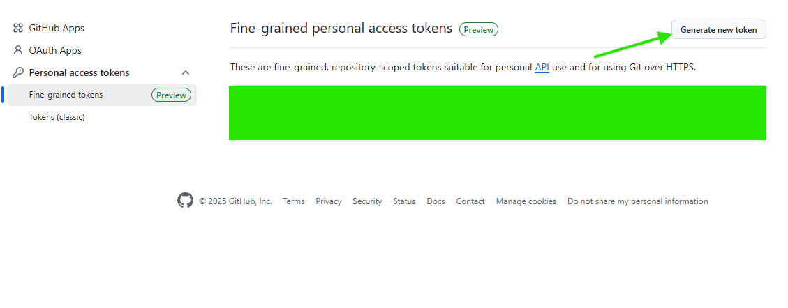
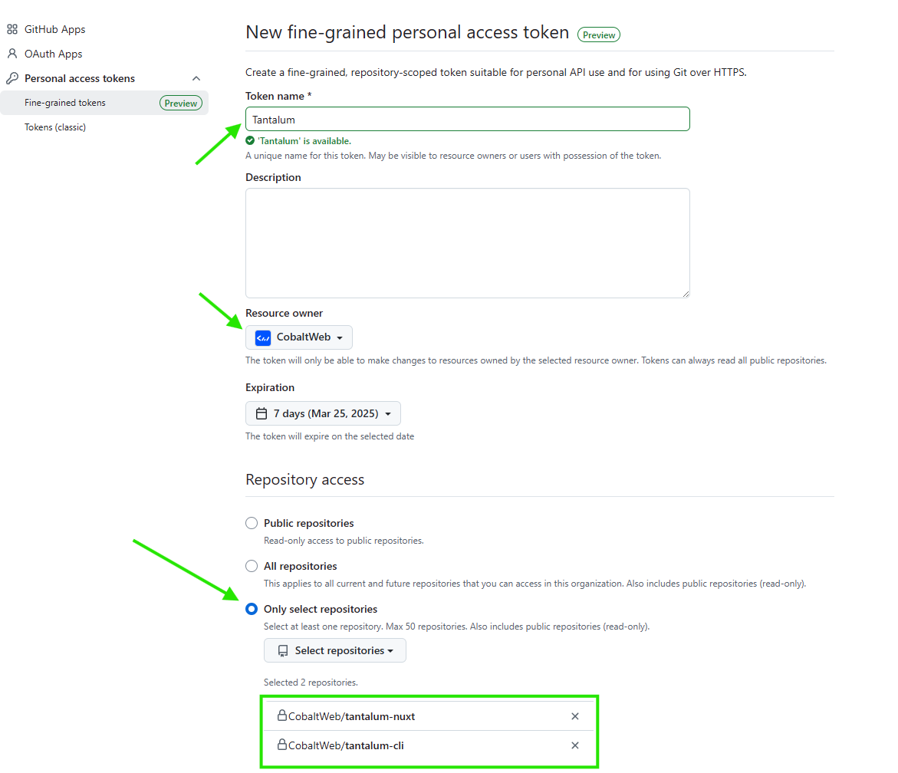
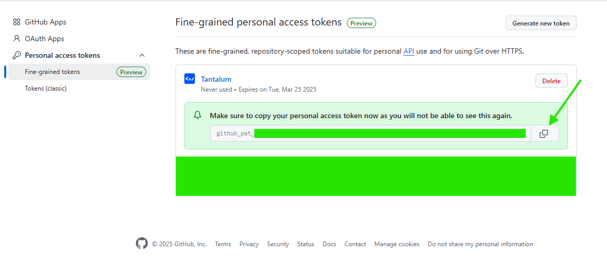

# Local setup

Get started with Tantalum quickly. Get your project up and running in 5 minutes.

## Prerequisites

- [Node.js](https://nodejs.org/) version 20 or higher.
- Terminal to use command line interface (CLI).
- Docker installed on your system.
- [Github.com](https://github.com/) account

## Retrieving Github personal access token (PAT)

1. Go to your [Github tokens settings](https://github.com/settings/tokens)
2. Generate new Fine-grained token 
3. Fill name. As Resource owner select **Cobaltweb**. Choose expiration date.
4. In **Repository access** section select **Only selected repositories** then select `CobaltWeb/tantalum-nuxt` and `CobaltWeb/tantalum-cli`. 
4. In **Permissions** section go to **Repository permissions** and add **Read-only** access to **Contents**
5. On the bottom of the page click "Generate token" and confirm creation.
6. Copy generated Token 

## Adding enviromental variable with PAT

Because passing PAT in terminal is not good idea we will setup env variable for it.

### Windows (Powershell)
```
  $env:GIGET_AUTH = "<your-access-token>"
```

### Linux/MacOS
```
  export GIGET_AUTH="<your-access-token>"
```

:::info
  Alternativly you can pass your PAT instead of `$env:GIGET_AUTH` and `${GIGET_AUTH}`. Although using enviromental variable is recommended solution.
:::


## Runing CLI

Windows (Powershell)
::: code-group

```powershell
npx -p https://<your-github-username>:$env:GIGET_AUTH@github.com/cobaltweb/tantalum-cli tantalum init
```

:::

MacOS/Linux
::: code-group

```sh [npm]
$ npx -p https://<your-github-username>:${GIGET_AUTH}@github.com/cobaltweb/tantalum-cli tantalum init
```

:::

This command will install and execute tantalum-cli, which will allow you to setup your Tantalum project.
You will be asked few questions mostly required for Directus setup. After you aswer them it will
setup all files needed for Tantalum setup.
